# Hi, I'm A1C0NY

**Yi Long · Tongji University, Shanghai, China** 

<!-- 访客计数器 -->

##  About Me
### 最近在做的方向
1.   **AI的医学领域应用**：口腔多模态数据配准（CBCT-IOS配准）
2.   **LLM/VLM**: 模型压缩和量化
   
### 正在学习
1. **多模态大模型（VLM）和语言大模型（LLM）**，以及与之相关的各种技能（微调，RAG，压缩......）
2. **mySQL + alembic**（基于高德 API 的公交/地铁线路查询系统 `CityTrans`） 

### 做过
1. **计算机视觉**: 口腔健康检测（DINOv3 + YOLOv10 / Faster-RCNN的视觉模型训练和微调）
2.  **大模型**: 口腔健康Agent（LLM/VLM，RAG知识库检索）

## GitHub Stats

<!-- 贡献活动图：由 .github/workflows/snake.yml 生成到 output 分支，不依赖 vercel -->

  

<!-- 统计卡片：由 .github/workflows/cards.yml 生成为静态 SVG，不依赖 vercel -->

  
  

<!-- 贡献蛇形图：由 .github/workflows/snake.yml 生成到 output 分支 -->
<!-- 

  <picture>
    <source media="(prefers-color-scheme: dark)" srcset="https://raw.githubusercontent.com/A1C1NY/A1C1NY/output/github-contribution-grid-snake-dark.svg" />
    
  </picture>

 -->

## Tech Stack
<!-- shields.io 徽章 -->

  
  
  

## Featured Projects

<table>
  <tr>
    <td width="50%" valign="top">
      <h3><a href="https://github.com/A1C1NY/tooth_VLM_APP">tooth_VLM_APP</a></h3>
      口腔健康检测应用 · DINOv3 + LLM 对话 + 知识库
        
      
      
      
    </td>
    <td width="50%" valign="top">
      <h3><a href="https://github.com/A1C1NY/dinoV3_ToothVLM">dinoV3_ToothVLM</a></h3>
      DINOv3 + YOLOv10 / Faster-RCNN 训练代码
        
      
      
      
    </td>
  </tr>
  <tr>
    <td width="50%" valign="top">
      <h3><a href="https://github.com/A1C1NY/CityTrans">CityTrans</a></h3>
      公交/地铁线路查询系统 · 高德 API
        
      
      
      
    </td>
    <td width="50%" valign="top">
      <h3><a href="https://github.com/A1C1NY/Topology-Static-Ver">Topology-Static-Ver</a></h3>
      一个简单的图形生成器 · C++ / SFML
        
      
      
      
    </td>
  </tr>
</table>

##  Connect with Me

  
  

  ⭐ 如果觉得有用，欢迎 Star 我的项目，感谢支持！

